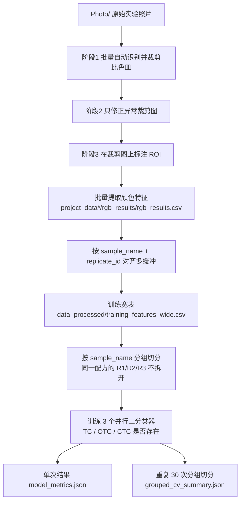

# Distinguish_TC

基于**多缓冲联合颜色响应**的 `TC / OTC / CTC` 定性存在性判别项目。

本仓库包含两件事：

1. 一套本地图像处理 GUI 工具：从实验照片中自动裁剪比色皿、修正异常、标注取色区（ROI）、批量提取颜色特征；
2. 一套多缓冲数据整理与多标签基线建模流程：把多个缓冲的颜色特征拼成训练表，判断 `TC`、`OTC`、`CTC` 三种物质各自"是否出现"。

> 核心目标**不是**定量求出浓度，而是回答三个是/否问题。

---

## 1. 问题定义

探针体系为 `1800 缓冲 + 200 探针`。加入 `TC / OTC / CTC` 后，在 `0~80 μM` 范围内颜色变化不同；且**同一样品在不同缓冲条件下的颜色变化模式也不同**。

因此判别依据不是单一缓冲下的某个颜色值，而是"同一份样品在多种缓冲下颜色模式一起怎么变"。

判别目标采用**多标签**而非 7 分类：

| 标签 | 含义 |
| --- | --- |
| `tc_present` | 是否存在 TC |
| `otc_present` | 是否存在 OTC |
| `ctc_present` | 是否存在 CTC |

标签生成规则：浓度 `>= 6 μM`（总浓度 `60 μM` 的 `10%`）记为存在 `1`，否则为 `0`。

| 组合 | 标签 |
| --- | --- |
| `blank` | `(0,0,0)` |
| `TC only` | `(1,0,0)` |
| `TC + OTC` | `(1,1,0)` |
| `TC + OTC + CTC` | `(1,1,1)` |

---

## 2. 整体流程



设计上的关键决策是**两阶段项目流**：先在原图上裁出比色皿并正式保存裁剪图，再在裁剪图上标注 ROI。这样 ROI 坐标更稳定、抽查更直观，也便于后续继续扩展缓冲数量。

---

## 3. 当前进展

当前已实际跑通 `water + T=8 + T=5 + T=10` 四缓冲闭环：

| 缓冲 | 项目目录 | 颜色特征结果 |
| --- | --- | --- |
| `water` | `project_data/` | `project_data/rgb_results/rgb_results.csv` |
| `T=8` | `project_data_t8/` | `project_data_t8/rgb_results/rgb_results.csv` |
| `T=5` | `project_data_t5/` | `project_data_t5/rgb_results/rgb_results.csv` |
| `T=10` | `project_data_t10/` | `project_data_t10/rgb_results/rgb_results.csv` |

- 实验规模：`35` 种唯一配方 × `3` 个独立重复 = `105` 个样品记录
- 训练表：`105` 行、`111` 列，默认特征数 `78`
- 默认模型：one-vs-rest 的 `Logistic Regression`（仓库内自写的 NumPy 实现，非 scikit-learn）
- 默认特征组：`rgb_best_plus_hsv_raw`，即 `RGB mean/std + 归一化 + 缓冲差值 + HSV 原始统计`

### 3.1 重复 30 次分组切分平均结果（主判断依据）

`model_runs/20260603_203318/grouped_cv_summary.json`，四缓冲、未加权均值：

| 指标 | 均值 | 标准差 |
| --- | --- | --- |
| `macro_f1` | `0.8716` | `0.0560` |
| `exact_match_ratio` | `0.5762` | `0.1462` |
| `hamming_loss` | `0.1651` | `0.0678` |

单标签 `F1`：`TC = 0.8365`、`OTC = 0.8995`、`CTC = 0.8789`。

### 3.2 颜色特征组合对比（三缓冲 30 次随机切分）

`model_runs/color_feature_experiments_20260601_113537/summary.json`：

| 特征组合 | 特征数 | `macro_f1` | `exact_match` |
| --- | --- | --- | --- |
| `rgb_plus_hsv_raw` | 54 | **0.8773** | **0.5984** |
| `all_raw_only` | 63 | 0.8715 | 0.5651 |
| `rgb_plus_hsv_lab_raw` | 72 | 0.8673 | 0.5603 |
| `old_rgb_best`（纯 RGB 最优） | 36 | 0.8648 | 0.5651 |
| `rgb_plus_lab_raw` | 54 | 0.8520 | 0.5460 |
| `rgb_plus_lab_raw_delta` | 63 | 0.8205 | 0.4698 |

结论：

- 纯 `RGB` 条件下，`mean + std + 归一化 + 缓冲差值` 已是最优组合；
- 再叠加 `HSV` 原始统计后效果最好，因此被定为默认训练方案；
- `Lab` 未带来稳定正收益，仅保留在提取层与实验层，不进默认训练与 GUI 展示。

> 说明：单次 `seed=42` 的 hold-out 结果（`macro_f1 = 0.7848`）只能证明流程可复现，**不应**作为方案优劣判断依据。比较模型/特征是否真的变好，请统一看重复分组评估的均值。

---

## 4. 目录结构

```
.
├── Photo/                          # 原始实验照片（不入库）
├── project_data/                   # water 缓冲项目目录
├── project_data_t5/                # T=5 缓冲项目目录
├── project_data_t8/                # T=8 缓冲项目目录
├── project_data_t10/               # T=10 缓冲项目目录
│   ├── project.json                # 项目状态：样本、裁剪记录、ROI 配置
│   ├── cropped_cuvettes/           # 比色皿裁剪图
│   ├── previews/                   # ROI 标注预览图
│   └── rgb_results/rgb_results.csv # 颜色特征结果表
├── data_sources/
│   └── buffer_sources.json         # 多缓冲训练输入配置
├── data_processed/                 # 多缓冲整理输出
│   ├── buffer_rgb_long.csv         # 多缓冲长表
│   ├── training_features_wide.csv  # 训练宽表
│   └── training_qc_summary.csv     # 质控表
├── model_runs/                     # 训练结果目录
├── src/distinguish_tc/             # 工具源码
│   ├── models.py                   # 数据结构定义
│   ├── parser.py                   # 文件名解析与图片扫描
│   ├── detector.py                 # 比色皿自动识别
│   ├── image_io.py                 # 图片读写（兼容中文路径）
│   ├── processor.py                # 裁剪 / 异常标记 / 取色 / 导出
│   ├── calibration.py              # ROI 比例坐标转换
│   ├── project_store.py            # 项目状态存取
│   ├── gui.py                      # Tkinter 界面
│   └── modeling/                   # 独立建模层
│       ├── dataset.py              # 拼表、派生特征、默认特征组
│       ├── baseline.py             # NumPy 逻辑回归 + 分组切分评估
│       └── pipeline.py             # 建模流程编排
├── docs/specs/                     # 设计文档
├── run_app.py                      # GUI 入口
├── run_extract_buffer.py           # 单缓冲命令行批处理入口
├── run_modeling_pipeline.py        # 建模流程入口
├── run_color_feature_experiments.py# 颜色特征组合对比实验
├── 启动工具.ps1                     # GUI 启动脚本
├── 启动模型训练.ps1                 # 训练启动脚本
├── environment.yml                 # Conda 环境说明
├── 实验方案.md                      # 实验与建模方案主文档
├── 项目概览.md                      # 项目交接与复用说明
└── 笔记记录.md                      # 指标释义与过程笔记
```

---

## 5. 环境与安装

依赖：`Python 3.11`、`numpy`、`pandas`、`pillow`、`opencv`。全部为标准库 + 常用科学计算库，建模部分不依赖 `scikit-learn`。

```json
// data_sources/buffer_sources.json
{
  "min_presence_uM": 6,
  "test_size": 0.2,
  "random_seed": 42,
  "buffers": [
    { "buffer_name": "water", "feature_prefix": "water",  "csv_path": "project_data/rgb_results/rgb_results.csv" },
    { "buffer_name": "T=8",   "feature_prefix": "tris8",  "csv_path": "project_data_t8/rgb_results/rgb_results.csv" },
    { "buffer_name": "T=5",   "feature_prefix": "tris5",  "csv_path": "project_data_t5/rgb_results/rgb_results.csv" },
    { "buffer_name": "T=10",  "feature_prefix": "tris10", "csv_path": "project_data_t10/rgb_results/rgb_results.csv" }
  ]
}
```

用 Conda 创建环境：

```bash
conda env create -f environment.yml
```

两个 PowerShell 启动脚本中写有 Python 绝对路径（`D:\Software\Miniconda\envs\Distinguish_TC\python.exe`），**换机器时需按实际环境修改该变量**。也可以完全不使用脚本，直接用绝对路径调用 `python.exe`。

---

## 6. 快速开始

### 6.1 图像处理 GUI（单缓冲全流程）

```bash
python run_app.py
```
或运行 `.\启动工具.ps1`。

界面分为三个阶段页签：

| 页签 | 作用 |
| --- | --- |
| 阶段1 原图裁剪 | 扫描 `Photo/`，批量自动识别并裁剪全部比色皿 |
| 阶段2 异常修正 | 只处理异常待修正列表中的图片，手动重画裁剪框 |
| 阶段3 ROI 取色 | 在裁剪图上标注取色区，保存 ROI 配置并批量提取特征 |

推荐操作顺序：

1. 选择原图目录 `Photo/`；
2. 创建项目，项目目录填 `project_data/`（或对应缓冲目录）；
3. 阶段1 批量自动裁剪；
4. 阶段2 只修正异常列表里的图片；
5. 阶段3 标注 ROI 并保存 ROI 配置；
6. 批量提取颜色特征；
7. 在 `project_data/rgb_results/rgb_results.csv` 查看结果表，在 GUI 中查看 `RGB + HSV` 摘要与预览图。

### 6.2 命令行批量提取某个缓冲

适合新增缓冲时复用已标定好的 ROI 配置，跳过手工操作：

```bash
python run_extract_buffer.py --project-dir project_data_t8 --buffer "T=8"
```

参数说明：

| 参数 | 说明 |
| --- | --- |
| `--source-dir` | 原始图片目录，默认 `Photo` |
| `--project-dir` | 输出项目目录（必填） |
| `--roi-project` | 复用 ROI 的项目文件，默认 `project_data/project.json` |
| `--buffer` | 要处理的缓冲名，可重复传入 |

### 6.3 多缓冲整理与基线训练

```bash
python run_modeling_pipeline.py
```
或运行 `.\启动模型训练.ps1`，也可覆盖最近一次训练结果：

```powershell
.\启动模型训练.ps1 -OverwriteLatest
.\启动模型训练.ps1 -GroupedEvalSeedCount 50
```

### 6.4 颜色特征组合对比实验

```bash
python run_color_feature_experiments.py --seed-count 30
```

---

## 7. 文件名命名规范

`Photo/` 下的图片文件名由 `parser.py` 解析，用于自动得到缓冲名、组别、浓度与重复编号：

```
<缓冲名>_<组别>[_<TC浓度>,<OTC浓度>,<CTC浓度>][_<重复序号>].jpg
```

| 部分 | 规则 |
| --- | --- |
| 缓冲名 | 不包含下划线，允许含 `=`，如 `water`、`T=8`、`T=5`、`T=10` |
| 组别 | `blank` / `single` / `binary` / `ternary` |
| 浓度 | 三个整数，逗号分隔，单位 `μM`；`blank` 可省略 |
| 重复序号 | 可省略，省略或 `0` 记为 `R1`，`1` 记为 `R2`，依此类推 |

示例：`T=8_binary_48,12,0.jpg` → 缓冲 `T=8`、`sample_name = binary_TC48_OTC12_CTC0`、`R1`。

---

## 8. 数据流水线

三层结构，单缓冲结果与多缓冲训练解耦：

| 层级 | 产物 | 说明 |
| --- | --- | --- |
| 单缓冲结果层 | `project_data*/rgb_results/rgb_results.csv` | 每个缓冲各自导出 |
| 多缓冲整理层 | `data_processed/buffer_rgb_long.csv`<br/>`data_processed/training_features_wide.csv`<br/>`data_processed/training_qc_summary.csv` | 按 `sample_name + replicate_id` 对齐后拼表 |
| 基线训练层 | `model_runs/<timestamp>/` | 多标签判别结果 |

### 8.1 质控规则

拼表时按每个 `(sample_name, replicate_id)` 检查四个缓冲的完整性，`qc_status` 取值：

- `ready`：四个缓冲全部 `status = ok`，进入训练集；
- `missing_buffer`：缺少某个缓冲；
- `failed_buffer`：某缓冲提取失败；
- `duplicate_buffer`：同一缓冲出现重复记录。

只有 `ready` 的记录才会进入训练宽表。

### 8.2 单缓冲结果表字段

`rgb_results.csv` 主要字段：

| 字段 | 含义 |
| --- | --- |
| `image_path` / `crop_path` | 原图 / 裁剪图相对路径 |
| `buffer_name` / `group_type` | 缓冲名 / 分组类型 |
| `sample_name` / `replicate_id` | 规范化样本名 / 重复编号 |
| `tc_conc_uM` / `otc_conc_uM` / `ctc_conc_uM` | 三种物质浓度 |
| `roi_mean_r/g/b`、`roi_std_r/g/b` | ROI 区 RGB 均值与标准差 |
| `hsv_mean_h/s/v`、`hsv_std_h/s/v` | HSV 均值与标准差 |
| `lab_mean_l/a/b`、`lab_std_l/a/b` | Lab 均值与标准差 |
| `pixel_count` / `kept_pixel_count` | ROI 总像素数 / 亮度裁剪后参与统计的像素数 |
| `status` / `warning` | 处理状态（`ok` / `failed`）/ 警告信息 |
| `roi_profile_name` / `preview_path` | 使用的 ROI 配置名 / 标注预览图路径 |
| `error_message` | 失败原因 |

### 8.3 默认特征组 `rgb_best_plus_hsv_raw`

对每个缓冲分别包含：

- `RGB mean`、`RGB std`
- `RGB norm`：`R/(R+G+B)`、`G/(R+G+B)`、`B/(R+G+B)`
- `HSV mean`、`HSV std`
- 缓冲间 `RGB mean` 差值，如 `water_minus_tris10_mean_r`

四缓冲下合计 `78` 个特征。`Lab` 相关列被显式排除。

### 8.4 为什么 ROI 不取整个比色皿

比色皿边框有明显高亮反光、顶部液面弯月面会拉偏颜色、底部反射不代表样品主体颜色。因此 ROI 只截取液体中部/中下部的稳定核心区，并在 ROI 内部按亮度做分位数裁剪（`trim_percent`），剔除高光与暗角像素。

---

## 9. 训练与评估

### 9.1 数据划分原则（关键）

**禁止重复泄漏**：同一 `sample_name` 的 `R1 / R2 / R3` 必须整体进训练集或整体进测试集，不能拆开。

实现方式：按 `sample_name` 分组切分（`split_groups`），测试集里的配方对模型是"未见过的配方点"，更接近真实泛化能力。

### 9.2 重复分组评估

单次 hold-out 波动大，因此默认在每次训练后额外执行 `30` 次重复分组切分，输出均值与标准差：

- `grouped_cv_summary.json`：均值/标准差 + 各标签 `precision/recall/f1` 统计
- `grouped_cv_details.csv`：逐次明细

次数可通过 `启动模型训练.ps1 -GroupedEvalSeedCount <n>` 或 `run_modeling_pipeline.py --grouped-eval-seed-count <n>` 调整。

### 9.3 指标含义

| 指标 | 含义 | 方向 |
| --- | --- | --- |
| `macro_f1` | `TC/OTC/CTC` 三个标签 `F1` 的平均，整体判别力 | 越高越好 |
| `exact_match_ratio` | 一条样本三个标签**全部**判对的比例，最严格 | 越高越好 |
| `hamming_loss` | 标签级别平均错误率 | 越低越好 |
| 单标签 `F1` | 某一种物质单独的识别能力（兼顾 precision 与 recall） | 越高越好 |

### 9.4 训练结果目录内容

`model_runs/<timestamp>/`：

| 文件 | 内容 |
| --- | --- |
| `model_metrics.json` | 单次分组 hold-out 指标、特征清单、标准化参数 |
| `predictions.csv` | 测试集预测标签与概率 |
| `feature_columns.txt` | 本次使用的特征列 |
| `grouped_cv_summary.json` | 重复分组评估汇总（主判断依据） |
| `grouped_cv_details.csv` | 重复分组评估逐次明细 |

---

## 10. 文档索引

| 文档 | 内容 |
| --- | --- |
| `实验方案.md` | 实验设计、样品配方表、建模方案、评价标准、第二阶段扩展思路 |
| `项目概览.md` | 项目定位、已实现功能、目录说明、设计演进与踩坑记录、TODO |
| `笔记记录.md` | 指标释义、相机专业模式参数、特征取舍说明、训练方案通俗解释 |
| `docs/specs/2026-05-26-图像自动裁剪与RGB建模流程设计.md` | 第一版流程设计 |
| `docs/specs/2026-05-27-双缓冲数据整理与基线训练流程设计.md` | 双缓冲整理与训练设计 |
| `区分TC OTC CTC共存-*.md` | 实验背景与前期讨论记录 |

---

## 11. 开发约定

- 所有文本 I/O 统一 UTF-8；CSV 导出使用 `utf-8-sig` 以便 Excel 直接打开；
- 文档与代码中的路径一律使用**相对路径**；
- 图片读写统一走 `image_io.py` 的 `np.fromfile + cv2.imdecode`，避免 Windows 中文路径下 `cv2.imread` 不稳定；
- ROI 必须**相对裁剪图**保存为比例坐标，而非相对原图的绝对像素；
- 异常图状态单独维护，不把"横向/纵向位置漂移"本身判为异常（位置变化是实验设计的一部分）；
- GUI 与建模层保持解耦：GUI 负责单缓冲取色，建模层通过 `data_sources/ → data_processed/ → model_runs/` 消费结果。

---

## 12. 已知限制与后续计划

当前限制：

- 样本规模较小（`105` 条记录、`35` 种配方），结论需继续用更多缓冲与边界样本验证；
- 统一使用 `0.5` 阈值，会压低弱标签召回（`CTC` 目前相对最弱）；
- 仅验证了线性模型，尚未接入非线性模型对照；
- 每次新增样本取色时会对全部照片重新取色，尚未做增量取色。

计划：

- 针对 `TC / OTC / CTC` 分别做阈值优化；
- 在相同 grouped split 口径下增加 `Random Forest` 等非线性模型对照；
- 增加更多候选缓冲与第二阶段不同总浓度（`20 / 40 / 60 / 80 μM`）；
- 训练结果导出可视化 HTML 报告与图表；
- 建模层增加探索性分析（PCA、均值图谱、特征重要性）；
- 交互优化：单图 ROI 覆盖、异常图快捷切换、增量取色；
- 工程化：打包独立桌面程序、错误日志、基础自动化测试。

---

## 13. 数据与隐私

- 原始实验照片 `Photo/`、裁剪图 `cropped_cuvettes/`、预览图 `previews/`、训练结果 `model_runs/` 中体积较大的图片与部分中间产物按 `.gitignore` 规则不入库；
- 需要入库的是源码、方案文档、配置与结构化结果表（`rgb_results.csv`、`data_processed/` 下的 CSV）。

