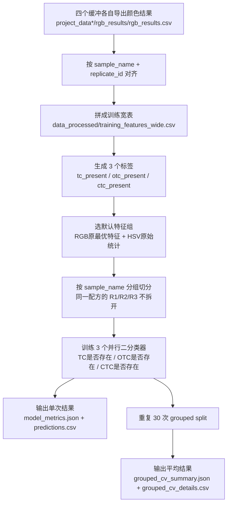

浓度肯定不能是存在一点就判定存在，如果是这样的话，这样就无穷尽了，检测限就太低了。

# 一些参数的含义

这些指标都是在回答同一件事：模型到底判得好不好，只是看的角度不同。

## macro_f1：模型对三种成分整体判别能力的平均水平

它是这三个标签 `TC / OTC / CTC` 的 `F1` 先分别算出来，再取平均。

`F1` 本身是在平衡两件事：

- 不要把没有的成分乱报出来
- 也不要把真的有的成分漏掉

它越高越好，`1` 最好，`0` 最差。

## exact_match_ratio：一个待测液的最终整体结论，能不能一次全判对？

这个指标最严格。一条样本里，`TC / OTC / CTC` 三个标签必须同时全对，才算成功；只要错一个，这条样本就算失败。

它越高越好。

## hamming_loss：从所有单个标签判断来看，出错的比例有多高？

这个指标看的是“标签级别的错误率”。

比如一条样本有 3 个判断：

- `TC` 对不对
- `OTC` 对不对
- `CTC` 对不对

如果错了 1 个，就记 1 次标签错误；很多样本加总后，算平均错误比例。

它越低越好。

`F1`
你后面看到的 `TC: 0.8477 -> 0.8722` 这种，是单个标签自己的 `F1`。
比如 `TC` 的 `F1`，只看模型对“是否有 TC”的判断。
它综合考虑：

- `precision`：报有 `TC` 的时候，报得准不准
- `recall`：真的有 `TC` 的样本，抓得全不全

所以：

- `TC F1` 表示模型识别 `TC` 的能力
- `OTC F1` 表示模型识别 `OTC` 的能力
- `CTC F1` 表示模型识别 `CTC` 的能力

你这次的结果里：

- `TC` 提升最大
- `OTC` 也有明显提升
- `CTC` 提升最小

可以把这些指标这样记：

- `macro_f1`：整体平均水平，看综合判别力
- `exact_match_ratio`：整条样本三标签全对的成功率
- `hamming_loss`：单个标签的平均错误率
- 单标签 `F1`：某一种成分单独的识别能力

如果你愿意，我可以下一步把 `precision / recall / f1 / accuracy` 这几个最容易混的概念也用一个很直观的小例子讲清楚。

# 分数虚高：或许我需要分数虚高

数据切分原则

这里我建议提前卡死一个重要规则：
按 replicate_id 随机切分不够安全，优先按“样本配方”分组切分。

更具体一点，第一版建议以 sample_name 为组来做 train/test split。原因是：

同一配方的不同重复往往很像
如果把同一 sample_name 的 R1 放训练、R2 放测试，分数可能虚高
我们真正想验证的是“模型能不能泛化到没见过的配方模式或至少没见过的样本实例”
如果样本量暂时不够大，第一版也可以先做一个较保守的 hold-out，并把这个限制明确写进结果说明里。

# 相机专业模式参数

在365nm下进行拍摄

6400 AISO
1/15 A Shutter
0.0 EV
0.08 Focus
4600 WB

# 数据取色

以前是只取颜色的RGB特征，但是判别力好像不足，所以加入了

- RGB原最优特征：mean + std + 归一化 + 缓冲差值
- 并新增HSV特征

提取层中还有lab特征，但是并没有写进GUI中，同时也没有在后续的训练中使用这个特征，因为使用这个特征带来的提升非常微小

# 训练模型

模型：one-vs-rest 的 Logistic Regression 基线
实现：不是 scikit-learn，而是仓库里自己写的 NumPy 版逻辑回归，在 baseline.py (line 18)
标签形式：分别训练
tc_present
otc_present
ctc_present

现在的 Logistic Regression是线性模型，或许后续可以考虑一下非线性模型，从而优化模型训练的结果。

## codex/grouped-cv-training-eval 分支

是增加了重复多次 grouped split + 平均指标

# TODO

- 在颜色标准差异常时，可以只对该单个图片进行重新框选区域，而不是将所有图片都重新框选。
- 保存并标记已修正，只能单个条目进行选择，不能按住 shift 进行加选（全选）
- 后续界面的修改，现在先暂定为 Tkinter，后续可以更改为 pyside6
- 后续训练界面的修改，将最终训练的结果可以导出一个好看的 html 文件，以及做一些图表
- 现在每次新增一个样本，在进行取色时好像都要对全部的照片进行取色，所以后续可以优化一下，只对新增的样本进行取色。
- 现在的检测到异常的图片时，我重新框选比色皿区域，该区域并没有马上更新，右侧图片的预览也没有更新
  ✅- 横向位置异常是故意的，可不标记为异常，因为程序的第一步就是直接将比色皿扣出来，后续都只是对比色皿这个对象进行操作

# 现在的整体识别和训练过程

现在的训练方案，可以把它理解成一句话：

**不是让模型猜浓度，而是让模型判断 `TC`、`OTC`、`CTC` 这 3 种物质“有没有出现”。**

对应代码入口主要在：

- [run_modeling_pipeline.py](/D:/Desktop/Distinguish_TC/run_modeling_pipeline.py)
- [src/distinguish_tc/modeling/pipeline.py](/D:/Desktop/Distinguish_TC/src/distinguish_tc/modeling/pipeline.py)
- [src/distinguish_tc/modeling/dataset.py](/D:/Desktop/Distinguish_TC/src/distinguish_tc/modeling/dataset.py)
- [src/distinguish_tc/modeling/baseline.py](/D:/Desktop/Distinguish_TC/src/distinguish_tc/modeling/baseline.py)

**1. 现在到底在训什么**
当前训练目标不是 7 分类，也不是回归浓度，而是 3 个并行的是/否判断：

- `tc_present`
- `otc_present`
- `ctc_present`

比如一个样品是 `TC48 / OTC12 / CTC0`，那它的标签就是：

- `tc_present = 1`
- `otc_present = 1`
- `ctc_present = 0`

也就是 `(1, 1, 0)`。

你可以把它想成：
**同一张“成绩单”，要同时回答 3 个问题，而不是只回答 1 个总分类问题。**

**2. 训练数据是怎么来的**
训练数据不是直接用原图，而是这样来的：

1. 四个缓冲各自提取颜色结果
   文件来自：

- `project_data/rgb_results/rgb_results.csv`
- `project_data_t8/rgb_results/rgb_results.csv`
- `project_data_t5/rgb_results/rgb_results.csv`
- `project_data_t10/rgb_results/rgb_results.csv`

配置写在：

- [data_sources/buffer_sources.json](/D:/Desktop/Distinguish_TC/data_sources/buffer_sources.json)

2. 按同一个样品对齐四个缓冲
   对齐键是：

- `sample_name`
- `replicate_id`

意思就是：
同一个配方、同一个重复编号，在 `water / T=8 / T=5 / T=10` 下的颜色特征，会被拼成同一行。

例如：

- `binary_TC48_OTC12_CTC0 + R2`

会变成一行，里面同时有：

- `water_*`
- `tris8_*`
- `tris5_*`
- `tris10_*`

**3. 一行数据里到底有什么特征**
当前默认特征组叫：

- `rgb_best_plus_hsv_raw`

可以简单理解成：

**每个缓冲都拿一组 RGB 统计，再加一组 HSV 统计，再加缓冲之间的颜色差值。**

更具体一点，主要包括：

- 每个缓冲的 `RGB mean`
- 每个缓冲的 `RGB std`
- 每个缓冲的 `RGB norm`
  - 就是 `R / (R+G+B)`、`G / (R+G+B)`、`B / (R+G+B)`
- 每个缓冲的 `HSV mean/std`
- 缓冲之间的 `RGB mean` 差值
  - 比如 `water_minus_tris10_mean_r`

当前四缓冲默认总特征数是：

- `78`

你可以把它想成：

**模型不是只看“某一张图偏红还是偏蓝”，而是在看“同一个样品在四种缓冲下，颜色模式一起怎么变”。**

**4. 标签是怎么打的**
标签规则很直接：

- 浓度 `>= 6 μM` 就记为“存在” `1`
- 浓度 `< 6 μM` 就记为“不存在” `0`

所以：

- `TC = 0` -> `tc_present = 0`
- `TC = 6` -> `tc_present = 1`
- `TC = 48` -> `tc_present = 1`

这部分是在拼训练表时自动生成的。

**5. 现在的模型本体是什么**
当前不是深度学习，也不是随机森林。

现在的默认模型是：

**3 个并行的二分类 Logistic Regression**

也就是：

- 模型 A：专门判断 `TC` 在不在
- 模型 B：专门判断 `OTC` 在不在
- 模型 C：专门判断 `CTC` 在不在

实现就在：

- [baseline.py](/D:/Desktop/Distinguish_TC/src/distinguish_tc/modeling/baseline.py)

而且它不是 `scikit-learn`，是仓库里自己写的 NumPy 版本。

你可以把它理解成：

**不是一个老师一次性给 3 门课总分，而是 3 个老师分别给“TC / OTC / CTC”打分。**

最后每个老师都会给一个概率，比如：

- `P(TC存在) = 0.82`
- `P(OTC存在) = 0.91`
- `P(CTC存在) = 0.27`

然后用固定阈值 `0.5` 判断：

- 大于等于 `0.5` -> 预测为 `1`
- 小于 `0.5` -> 预测为 `0`

所以最后结果就是：

- `(1, 1, 0)`

**6. 为什么不是随便随机切训练集和测试集**
这里是现在方案里很关键的一点。

不是按“每一行随机抽 20% 做测试”，而是：

**按 `sample_name` 分组切分。**

原因是同一个配方有 `R1 / R2 / R3` 三个重复。
如果 `R1` 进训练集，`R2` 进测试集，就会泄漏，因为它们本质上是同一个配方点。

所以现在做法是：

- 一个 `sample_name` 的 3 个重复，要么全进训练集
- 要么全进测试集

这样测试才更像“模型没见过这个配方”。

这一步很像：

**考试时不能让模型先看过同一道题的标准答案，再去做只改了个编号的同题。**

**7. 为什么我这次又加了 repeated grouped split**
因为你之前看到的很多“最新结果”，其实都只是：

- 固定 `seed=42`
- 做一次分组切分
- 跑一次

这样的问题是：

**一次 split 运气成分太大。**

有时候刚好测试集简单，分数就高。
有时候刚好测试集难，分数就低。

所以我这次加的是：

- 重复做 `30` 次 grouped hold-out
- 每次都重新按 `sample_name` 分组切
- 最后看平均值和波动

新输出是：

- [grouped_cv_summary.json](/D:/Desktop/Distinguish_TC/model_runs/20260603_203318/grouped_cv_summary.json)
- [grouped_cv_details.csv](/D:/Desktop/Distinguish_TC/model_runs/20260603_203318/grouped_cv_details.csv)

这就像：

**不是只考 1 套卷子，而是连续考 30 套同难度卷子，然后看平均分。**

这个平均分更可信。

**8. 现在最新结果该怎么看**
同一个最新目录：

- [model_runs/20260603_203318](/D:/Desktop/Distinguish_TC/model_runs/20260603_203318)

里面有两类结果。

1. 单次结果
   文件：

- [model_metrics.json](/D:/Desktop/Distinguish_TC/model_runs/20260603_203318/model_metrics.json)

这是固定一次 split 的结果：

- `macro_f1 = 0.7848`
- `exact_match_ratio = 0.3333`
- `hamming_loss = 0.2698`

2. 30 次平均结果
   文件：

- [grouped_cv_summary.json](/D:/Desktop/Distinguish_TC/model_runs/20260603_203318/grouped_cv_summary.json)

这是现在更该看的主结果：

- `macro_f1_mean = 0.8716`
- `exact_match_ratio_mean = 0.5762`
- `hamming_loss_mean = 0.1651`

简单理解：

- `model_metrics.json` = 某一次考试成绩
- `grouped_cv_summary.json` = 连考 30 次后的平均成绩

以后如果你问“当前方案真实水平怎么样”，我建议默认看第二个。

**9. 这些指标到底是什么意思**
最重要的 3 个你可以这样记：

- `macro_f1`
  - 3 个标签 `TC/OTC/CTC` 的平均表现
  - 越高越好
- `exact_match_ratio`
  - 一整个样品 3 个标签全都猜对的比例
  - 比如真实是 `(1,1,0)`，预测也必须正好 `(1,1,0)` 才算对
  - 越高越好
- `hamming_loss`
  - 每个标签平均出错率
  - 越低越好

举个例子：

真实标签：

- `(1,1,0)`

预测标签：

- `(1,0,0)`

那这条样品：

- `TC` 对了
- `OTC` 错了
- `CTC` 对了

所以：

- 不是 exact match
- 但也不是全错
- `hamming_loss` 会记成 “3 个标签里错了 1 个”

**10. 你现在最该怎么理解这套方案**
如果只用最简单的话总结，就是：

- 先把四个缓冲下的颜色特征拼成一行
- 再把每个样品转换成 3 个“是否存在”的标签
- 用 3 个并行逻辑回归分别判断 `TC / OTC / CTC`
- 为了避免重复样品泄漏，按 `sample_name` 分组切训练/测试
- 为了避免一次切分运气太大，再重复 30 次取平均

所以现在这套训练方案，本质上是在做：

**“利用四种缓冲的联合颜色响应，稳定判断 3 种物质是否存在。”**

流程图示意如下：

- Python ：整个项目的编程语言基础
- Tkinter ：Python 内置的 GUI（图形用户界面）库，用于构建工具的可视化界面，让用户可以通过窗口、按钮、菜单等交互操作
- OpenCV ：计算机视觉库，主要用于 自动识别比色皿 、图像处理、目标检测等核心视觉任务，是阶段1原图裁剪的核心工具
- Pillow（PIL） ：Python 图像处理库，用于图片的读取、保存、格式转换和基础图像处理操作
- NumPy ：数值计算库，提供高性能的数组运算，用于处理图像像素数据和数值计算
- pandas ：数据处理和分析库，用于整理颜色特征提取结果、生成结构化表格（如 rgb_results.csv ）等数据处理任务
